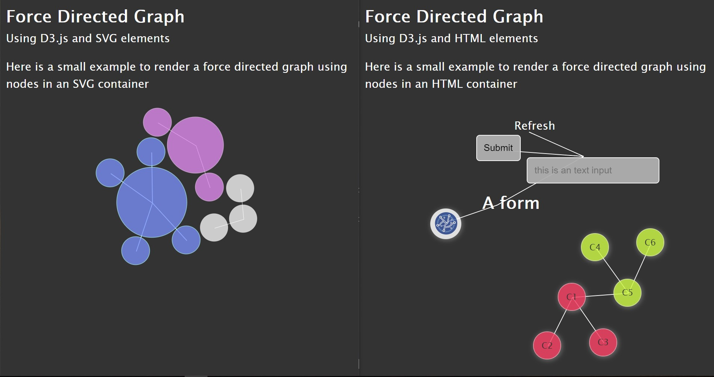

# D3-force-graph Component



An experiment around force directed graphs inspired by 
*[Disjoint Force-Directed Graph](https://beta.observablehq.com/@mbostock/disjoint-force-directed-graph)*

## Example of usage:
### Using SVG primitives
 
```
<d3-force-graph>
 <svg slot="nodes">
   <circle id=1 r=10></circle>
   <circle id=2 r=10></circle>
   ...
 </svg>
 <svg slot="links">
   <link source=1 target=2></link>
 </svg>
</d3-force-graph>
```
 
## Using HTML elements
 
```
<d3-force-graph>
 <div slot="nodes">
  <input id=1 type=text></input>
  <video id=2 src='...'></video>
   ...
 </svg>
 <svg slot="links">
   <link source=1 target=2></link>
 </svg>
</d3-force-graph>
```


